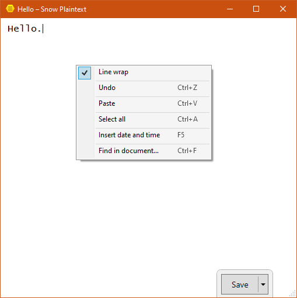

# Minimal Windows plain text editor – Snow Plaintext (2014)

A minimal and modern looking Windows Notepad replacement.

This software does not contain any malicious or tracking code. No viruses. No ads.

## Status: functional

No updates planned.

## Features

### Missing features

Unfortunately, Microsoft's own Windows Presentation Foundation (WPF) UI framework has undesirable performance and responsiveness, and the standard WPF TextBox leaves a lot to be desired even for plaintext editing.

- **Closing the app with unsaved changes shows no prompt and discards the changes!** This is intentional, as I use Plaintext as a scratch pad, but may be undesirable. The editor was supposed to have an auto-saving feature so you could restore unsaved changes, but it was never needed.
- Replace
- Printing
- The Save button gets in the way sometimes.
- Some (Unicode) symbols aren't monospaced / correctly grid aligned. ¯\\\_(ツ)_/¯
- Sometimes it takes a long time to start up, even on an SSD. Thanks, Microsoft.

## Licensing: non-commercial use only

Important points:
- Non-commercial use only.
- If you make modifications, you need to provide the modified unobfuscated source code.
- You may distribute modified or unmodified files, as long as you include the original unmodified licence.

Trademarks are owned by their respective owners.

Details in [LICENCE.txt](LICENCE.txt)

Please e-mail zdenek.gromnica@futuremillennium.com if you wish to discuss commercial use or different licensing terms.

## Contributing

By creating a pull request, contributors grant the author an express non-exclusive licence of their contributions to be included in the software and licensed under the same terms, with no additional terms.

## Found an error? Have any issues or feature requests?

Please add them in the [Issues](https://github.com/FutureMillennium/Snow-Plaintext/issues) section.

## [Please consider supporting on Patreon!](https://github.com/FutureMillennium/Psanii-Notepad-2009/issues)

Made by [Zdeněk Gromnica aka FutureMillennium](http://futuremillennium.com/).